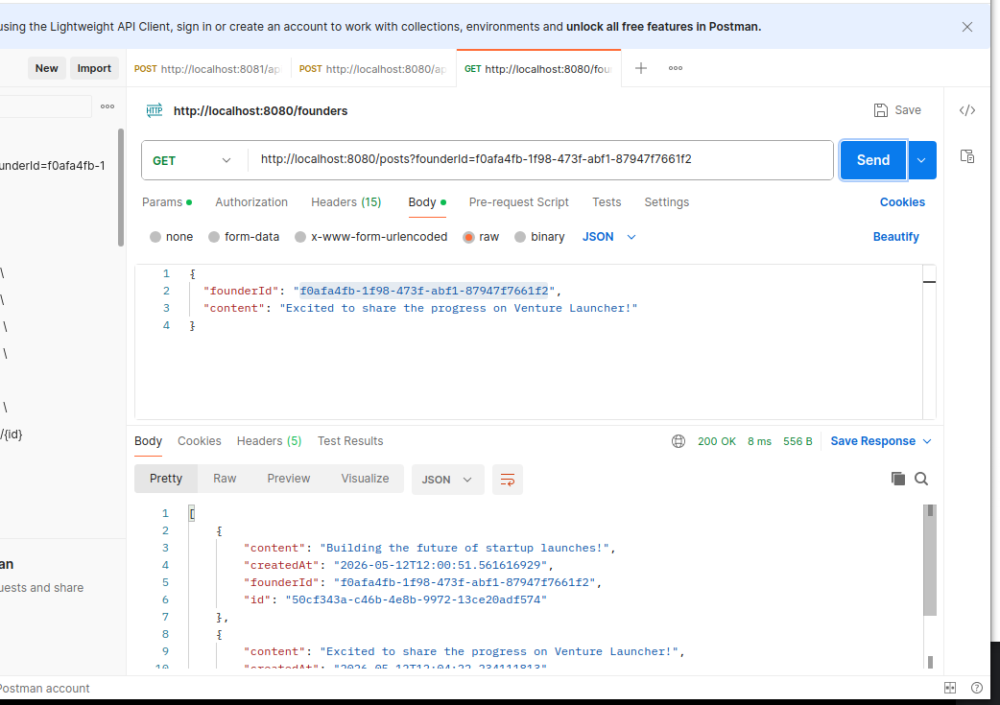
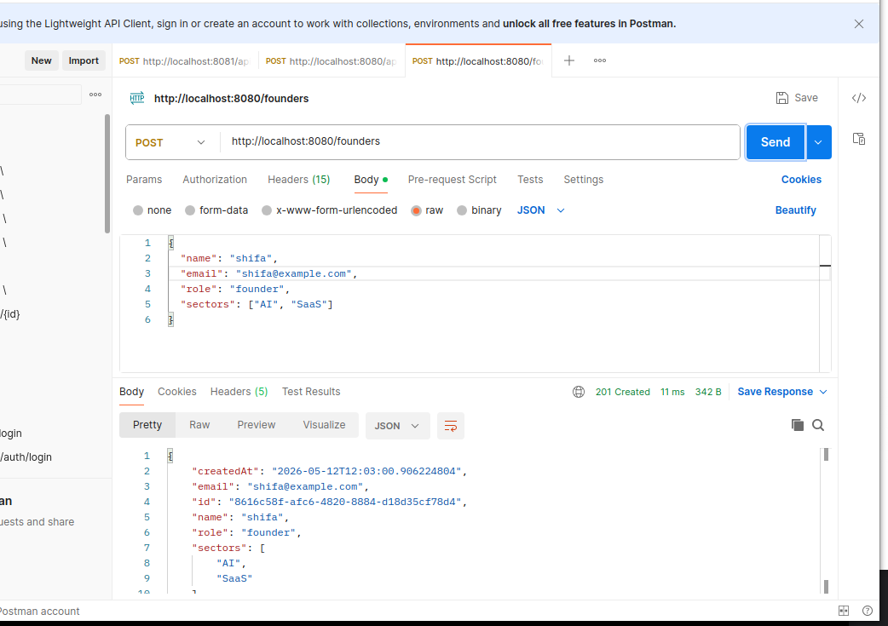
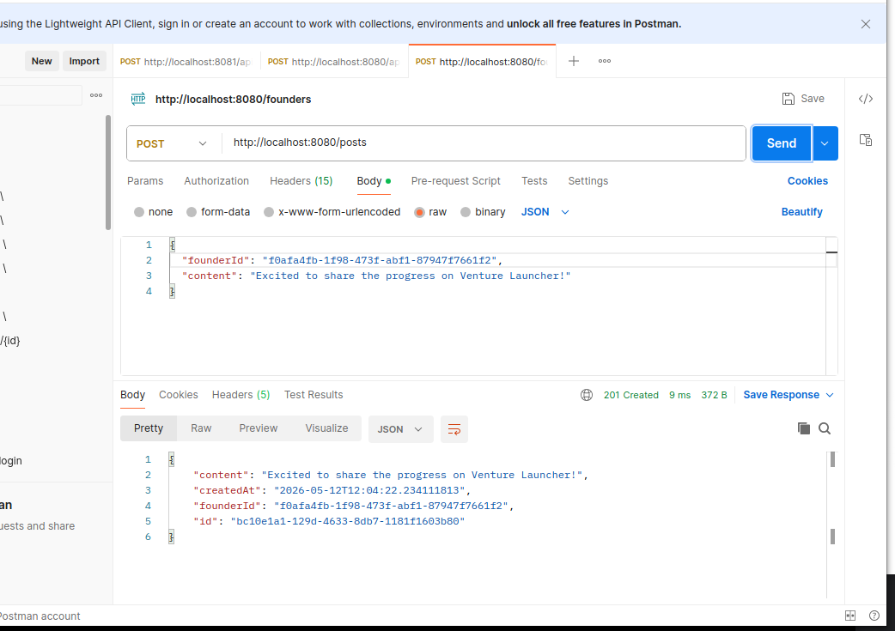
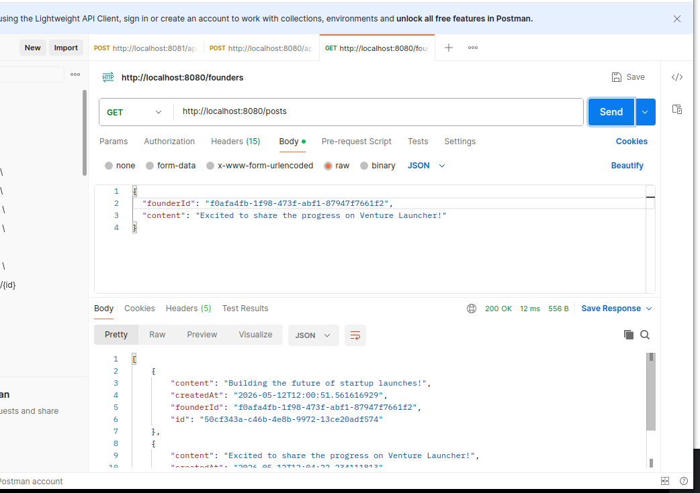

# Venture Launcher - Backend Assessment

This is a Spring Boot-based REST API for managing Founders and their Posts. It features thread-safe in-memory storage, input validation, and relationship verification.

## Tech Stack
- **Java 21**
- **Spring Boot 3.x**
- **Maven** (Build Tool)

## Getting Started

### Prerequisites
- JDK 21 installed.
- Maven (or use the included `./mvnw`).

### Running the Application
1. Clone the repository:
   ```bash
   git clone [https://github.com/shifajaman/venture-launcher-backend-test.git](https://github.com/shifajaman/venture-launcher-backend-test.git)
   ## API Testing (Postman)
## Screenshots

### Founder Section



### Posts

